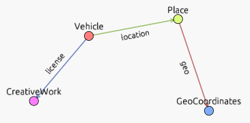

# MaSS

Conversie van de Maritime Stepping Stones (MaSS) database via harvesting van https://mass.cultureelerfgoed.nl/api/ en omzetting naar RDF via SPARQL Anything.
De JSON die via de API wordt geharvest wordt in verband met throttling opgeslagen in de cache directory.
De mass.rq bevat the SPARQL CONSTRUCT die de JSON omzet naar RDF. Vanwege missende data worden ook vanuit de lijst via mass-list.rq triples gemaakt.
Het script convert.sh voert alle bovengenoemde stappen uit en resulteert in het bestand all_mass.nt.

De RDF kan bekeken worden via [rdfglance](https://xdobry.github.io/rdfglance/?url=https%3A%2F%2Fraw.githubusercontent.com%2FHet-Zinkende-Schip%2FMaSS-RDF%2Frefs%2Fheads%2Fmain%2Fall_mass_unique.nt) en bevraagdd worden via SPARQL via https://qlever-ui.coret.org/mass 

# Requirements

- Bash
- Python 3
- [SPARQL-Anything](https://github.com/SPARQL-Anything/sparql.anything/releases)

# Commentaar API data	

- In https://mass.cultureelerfgoed.nl/api/v1/list/nl/ komen de properties `discovery` en `subtype` voor, die ontbreken in https://mass.cultureelerfgoed.nl/api/v1/get/nl/{id}. 
- In de HTML GUI komen de properties `Status`, `Protectie`, `Processtap`, `Nationaliteit` en `Eigenaar` voor, die komen niet terug in de API!
- Data van https://mass.cultureelerfgoed.nl/api/v1/references/ zijn niet verwerkt, lijkt te lopen via `backlinks` property (die url gebruikt i.p.v. numerieke code).
